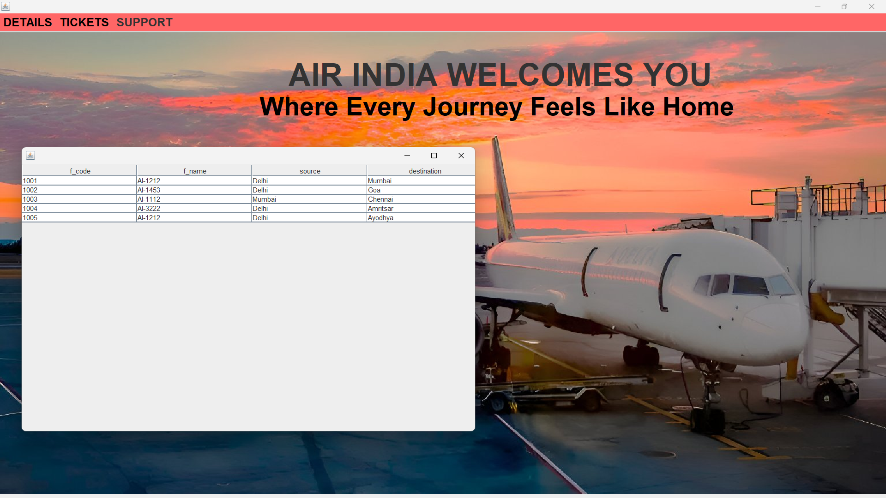
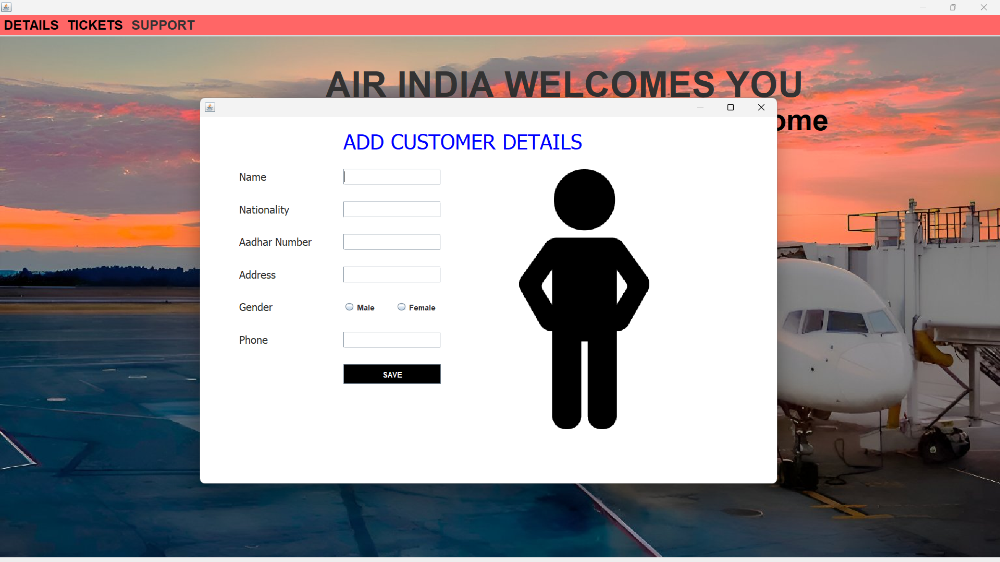
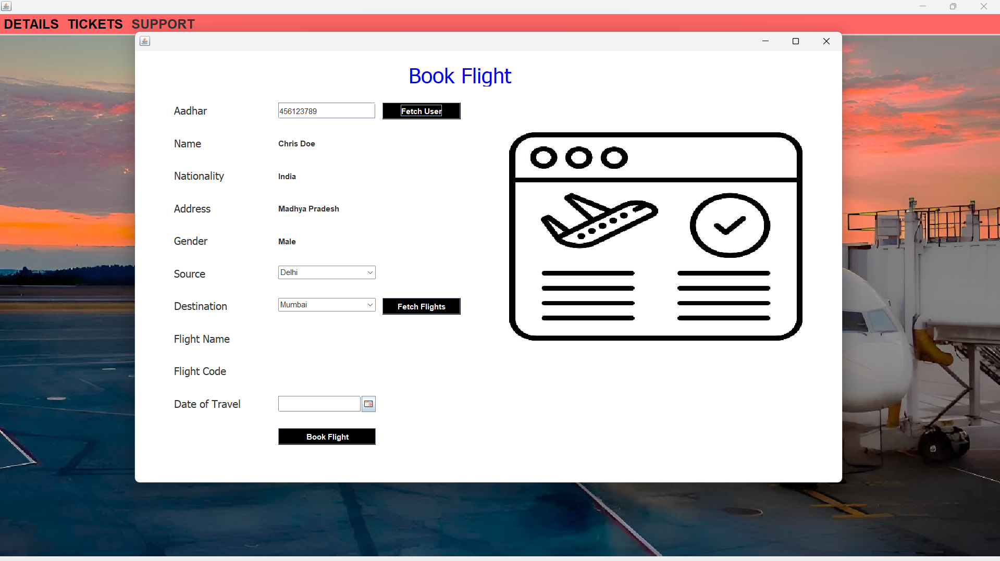
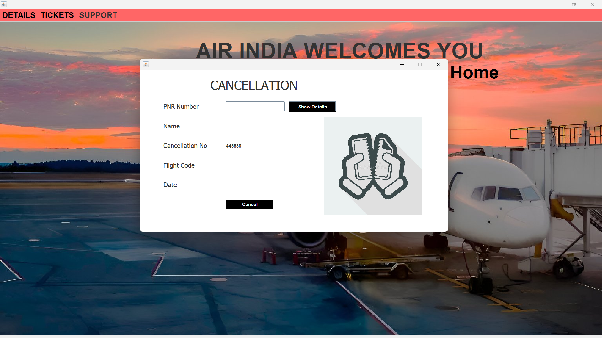
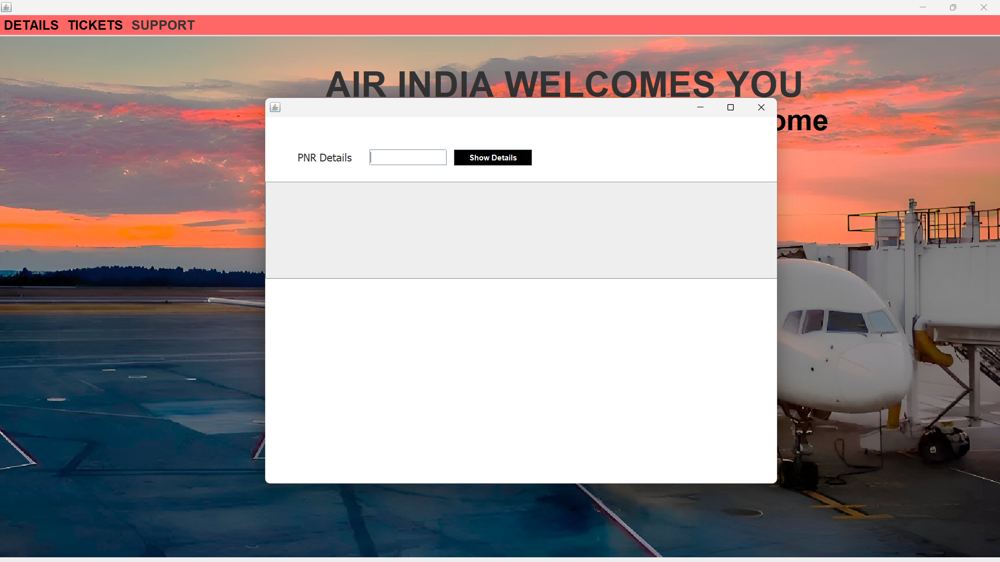

# AeroDB: Airline Management System

Welcome to **AeroDB** – a comprehensive Java-based desktop application that manages major facets of airline operations. This application uses dynamic GUIs with Swing and robust backend integration with MySQL to offer a seamless management experience. It features an intuitive user interface built with Java Swing and incorporates smooth animations and interactive menus. The backend is powered by MySQL, ensuring efficient data storage and retrieval.

## Features
- **Dynamic Home Screen:** Engaging GUI with animated elements that welcome users with style.
- **Interactive Menus:** Mouse-hover effects and responsive menus provide a delightful user experience.
- **Database Integration:** Seamless connectivity to a MySQL database for managing flight details, customer information, bookings, and more.
- **Comprehensive Operations:** Modules for adding customer details, flight information, booking flights, journey details, ticket cancellation, and support options.

## Technologies Used
- **Core Java:** For robust application logic and GUI development using Swing.
- **MySQL:** As the backend database for reliable data management.
- **Java Swing:** To create a responsive and interactive user interface.
- **JDBC:** For connecting and interacting with the MySQL database.

## Some key Insights

